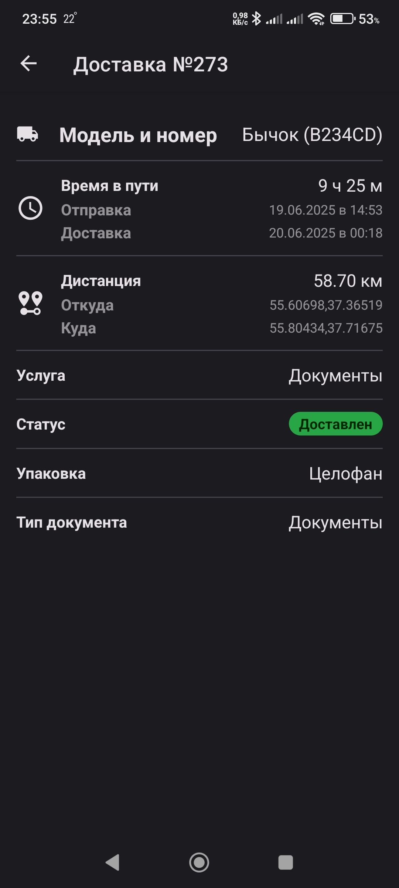

# Система доставки Absolut

<p align="center">
  
  
  
  
  
  
  
  
</p>

## Описание

**Absolut** — комплексная система для управления доставкой, включающая:
- **Backend**: Django + Django REST Framework (`backend/`)
- **Frontend**: React (`frontend/`)
- **Мобильное приложение**: React Native (Expo, `mobile-app/`)
- **База данных**: PostgreSQL (`postgres/`)
- **Traefik**: прокси и маршрутизация (Docker)

Всё запускается через Docker Compose, кроме мобильного приложения (оно запускается отдельно).

---

## Структура проекта

- `backend/` — Django backend (REST API, админка)
- `frontend/` — React frontend (SPA для пользователей и операторов)
- `mobile-app/` — Мобильное приложение (Expo/React Native)
- `postgres/` — Конфигурация и инициализация PostgreSQL
- `docker-compose.yml` — Запуск всех сервисов (кроме mobile-app)
- `Makefile` — Удобные команды для управления проектом

---

## Быстрый старт (backend, frontend, база, traefik)

1. Клонируйте репозиторий:
   ```bash
   git clone <URL>
   cd 2025.06.19-absolut
   ```

2. Запустите все сервисы:
   ```bash
   make setup
   ```
   Это автоматически поднимет базу, backend, frontend и применит миграции.

3. Откройте в браузере:
   - Frontend: [http://localhost](http://localhost)
   - Django Admin: [http://localhost/admin/](http://localhost/admin/)
   - Traefik Dashboard: [http://localhost:8080](http://localhost:8080)

---

## Мобильное приложение (Expo/React Native)

1. Перейдите в папку приложения:
   ```bash
   cd mobile-app
   ```

2. Установите зависимости:
   ```bash
   npm install
   ```

3. Запустите Expo:
   ```bash
   npx expo start
   ```

4. Откройте приложение:
   - На Android/iOS устройстве через Expo Go (отсканируйте QR-код)
   - В эмуляторе Android/iOS

**Важно:**
- Для работы мобильного приложения backend должен быть запущен и доступен по адресу, прописанному в коде (см. `app/(tabs)/deliveries.tsx`).
- Если запускаете не на localhost, укажите актуальный IP backend в fetch-запросах.

---

## Основные функции

- **Backend**: REST API, авторизация, админка, справочники, логика доставки
- **Frontend**: SPA для пользователей и операторов, фильтрация, просмотр, управление доставками
- **Мобильное приложение**: просмотр доставок, фильтры, детальный просмотр, цветные статусы, поддержка тёмной темы
- **База данных**: PostgreSQL, автоматическая инициализация
- **Traefik**: маршрутизация, прокси, удобный доступ к сервисам

---

## Полезные команды Makefile

- `make setup` — Первоначальная настройка и запуск всех сервисов
- `make migrate` — Применить миграции Django
- `make makemigrations` — Создать миграции Django
- `make createsuperuser` — Создать суперпользователя Django
- `make help` — Показать справку по доступным командам

---

## Примечания

- Все переменные окружения для сервисов можно изменить в файлах `docker-compose.yml` и Dockerfile соответствующих сервисов.
- Для разработки можно запускать backend и frontend отдельно, используя стандартные команды Django и npm, но в production всё работает через Traefik и http://localhost.
- Для загрузки справочников вручную:
  ```bash
  docker-compose run --rm django python manage.py load_reference_data
  ```
- Для тестирования и разработки мобильного приложения требуется установленный Node.js и Expo CLI.

---

## Полезные ссылки

- **Django Admin:** [http://localhost/admin/](http://localhost/admin/)
  - Логин: `admin`
  - Пароль: `admin123`
- **API:**
  - `/api/vehicle-models/` — Модели транспорта
  - `/api/packaging-types/` — Типы упаковки
  - `/api/services/` — Услуги
  - `/api/delivery-statuses/` — Статусы доставки
  - `/api/cargo-types/` — Типы груза